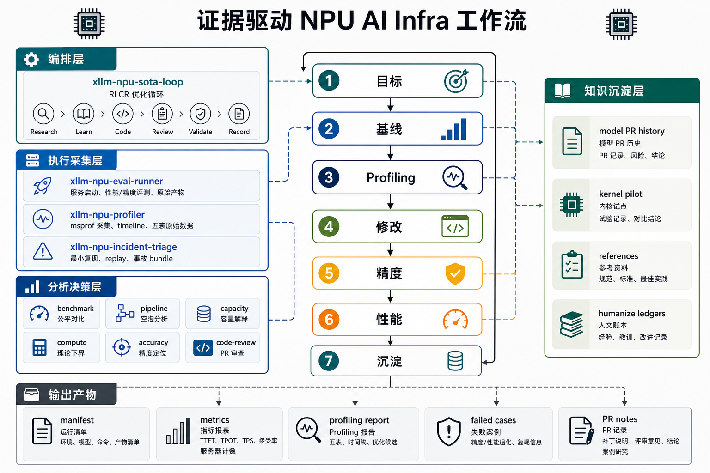

# xLLM AI Infra Workflow

[中文](README.md)

Agent-ready skills for large-model serving optimization on Ascend NPUs. The
first fully recorded landing target is
[xLLM](https://github.com/jd-opensource/xllm), while
[vLLM-Ascend](https://github.com/vllm-project/vllm-ascend) and SGLang NPU are
treated as fair baselines, reusable references, and future adaptation targets.

This repository is not a loose collection of tuning notes. It is an **xLLM AI
Infra Workflow** for performance, accuracy, profiling, incident triage, code
review, and PR-driven optimization.

## Vision

Many NPU serving optimizations fail because the evidence chain is broken:

- baseline runs have no warmup or run on contaminated devices;
- profiling traces are compared directly with non-profiling performance runs;
- MTP enablement is inferred only from evalscope accept rate;
- accuracy is judged from a few prompts without bad cases or A/B datasets;
- PR fixes do not preserve build, UT, accuracy, performance, and profiling
  artifacts.

This repository turns those lessons into reusable skills. Every serious
optimization should leave a traceable loop:

```text
target -> baseline -> profiling -> patch -> accuracy -> performance -> record
```

## Architecture



The repository is organized around an execution loop and reusable evidence
stores, not around one-off tuning notes:

| Layer | Entry Point | Responsibility |
|---|---|---|
| Orchestrator | `xllm-npu-sota-loop` | Coordinates Research, Learn, Code, Review, Validate, and Record |
| Execution & Collection | `xllm-npu-eval-runner`, `xllm-npu-profiler`, `xllm-npu-incident-triage` | Starts services, runs evaluations, captures profiling, replays incidents, and collects raw artifacts |
| Analysis & Decision | benchmark / pipeline / capacity / compute / accuracy / code-review | Turns performance, accuracy, capacity, bubbles, hardware limits, and PR risks into verifiable conclusions |
| Supporting Knowledge | `model-pr-optimization-history`, `kernel-pilot`, `references/`, `humanize/` | Stores historical PRs, kernel experiments, artifact schemas, optimization ledgers, and lineage |

A formal optimization should follow this evidence flow:

```text
Target -> Baseline -> Profiling -> Patch -> Accuracy -> Performance -> Record
```

Baseline/current performance runs must use warmup. Profiling runs explain
bottlenecks; they are not formal performance measurements.

## Core Approach

### 1. Unified Evidence Contracts

Formal conclusions must be reproducible:

| Contract | Purpose |
|---|---|
| [`run-manifest-template.md`](references/run-manifest-template.md) | Commit, environment, model, startup command, workload, artifact paths |
| [`perf-artifact-schema.md`](references/perf-artifact-schema.md) | TTFT/TPOT/TPS, warmup, sampling parameters, server-side counters |
| [`accuracy-artifact-schema.md`](references/accuracy-artifact-schema.md) | Raw predictions, failed cases, scores, validation levels |
| [`profiling-artifact-schema.md`](references/profiling-artifact-schema.md) | msprof capture, five tables, timeline notes, inconclusive rules |

### 2. Fair Benchmarking

`xllm-npu-benchmark` follows one rule: do not compare unfair data.

- Same model, tokenizer, dtype, workload, sampling, and SLA.
- Tune each framework independently.
- Use request-level warmup for formal performance runs.
- Save failed candidates, startup commands, NPU snapshots, and raw evalscope
  outputs.

### 3. Five-Table Profiling

`xllm-npu-profiler` summarizes Ascend profiling evidence into five tables:

| Table | Focus |
|---|---|
| Kernel | AICore / AI CPU hotspots |
| Communication / Overlap | HCCL, AllReduce, AllGather, overlap opportunities |
| Fuse Pattern | Known fusion patterns and replaceable operators |
| Dispatch | hostbound gaps, graph replay, synchronization, copies |
| Memory | KV cache, xTensor, HBM, fragmentation, capacity |

Profiling runs explain bottlenecks. They do not replace non-profiling before/after
performance runs.

### 4. Accuracy Debug Ladder

`xllm-npu-accuracy-debug` uses increasing validation cost:

```text
L1 one prompt readability
L2 5-10 deterministic prompts
L3 first N dataset cases
L4 one full task
L5 full benchmark dataset
```

The workflow prioritizes stable bad cases, log/code analysis, A/B comparisons,
and commit bisect when the introducing change is unknown.

### 5. RLCR Optimization Loop

`xllm-npu-sota-loop` follows RLCR:

```text
Research -> Learn -> Code -> Review -> Validate -> Record
```

- Research: read benchmark, profiling, capacity, and accuracy evidence.
- Learn: query model PR history and failed attempts.
- Code: one verifiable patch per round.
- Review: run NPU-specific code review.
- Validate: build, UT, accuracy, performance, and profiling when needed.
- Record: update humanize ledgers and case studies.

## Skills

| Skill | Use When | Main Artifacts |
|---|---|---|
| [`xllm-npu-eval-runner`](skills/xllm-npu-eval-runner/SKILL.md) | Start/reuse xLLM and run perf or accuracy evaluations | `runs/eval`, `runs/perf`, `runs/accuracy` |
| [`xllm-npu-benchmark`](skills/xllm-npu-benchmark/SKILL.md) | Compare xLLM / vLLM-Ascend / SGLang NPU performance | `summary.md`, `candidates.jsonl`, `winning-commands.md` |
| [`xllm-npu-profiler`](skills/xllm-npu-profiler/SKILL.md) | Explain TTFT/TPOT/TPS bottlenecks | five-table report, timeline notes, optimization candidates |
| [`xllm-npu-pipeline-analysis`](skills/xllm-npu-pipeline-analysis/SKILL.md) | Analyze prefill/decode, layer timing, rank skew, and decode bubbles | stage table, rank skew table, bubble table |
| [`xllm-npu-capacity-planner`](skills/xllm-npu-capacity-planner/SKILL.md) | Explain HBM/KV cache capacity, concurrency, and OOM risk | capacity table, capacity.json, report.md |
| [`xllm-npu-compute-simulation`](skills/xllm-npu-compute-simulation/SKILL.md) | Estimate FLOPs/MFU and hardware lower bounds | compute estimate, MFU table, what-if |
| [`xllm-npu-accuracy-debug`](skills/xllm-npu-accuracy-debug/SKILL.md) | Debug garbled outputs, CEval drops, GPU/NPU mismatch | bad cases, A/B table, bisect notes |
| [`xllm-npu-incident-triage`](skills/xllm-npu-incident-triage/SKILL.md) | Triage crash, OOM, HCCL, graph, PagedAttention incidents | incident bundle, replay report |
| [`xllm-npu-code-review`](skills/xllm-npu-code-review/SKILL.md) | Review NPU-related changes before PR submission | prioritized review findings |
| [`xllm-npu-sota-loop`](skills/xllm-npu-sota-loop/SKILL.md) | Iterate until a target performance goal is reached | run manifest, RLCR ledger, final summary |
| [`model-pr-optimization-history`](model-pr-optimization-history/SKILL.md) | Query historical work before optimizing a model | model dossier, risk notes |
| [`kernel-pilot`](kernel-pilot/SKILL.md) | Try kernel-level optimization after existing paths are exhausted | op benchmark, kernel notes |

## Typical Use

### Choose the Entry Point

| Task | Start With | Add When Needed |
|---|---|---|
| Run service, performance, or accuracy evaluation | `xllm-npu-eval-runner` | Use `xllm-npu-benchmark` for fair cross-framework comparison |
| Optimize TPOT / TTFT / TPS | `xllm-npu-sota-loop` | Phase 3 must use `xllm-npu-profiler` |
| Analyze decode bubbles or rank skew | `xllm-npu-pipeline-analysis` | Add `xllm-npu-compute-simulation` for hardware lower bounds |
| Explain OOM, KV cache, or serving capacity | `xllm-npu-capacity-planner` | Add `xllm-npu-incident-triage` for crashes |
| Debug garbled output or CEval regression | `xllm-npu-accuracy-debug` | Use bisect when the commit range is unclear |
| Prepare an xLLM NPU PR | `xllm-npu-code-review` | Also check the target repo's own `.agents/skills` |
| Try kernel-level optimization | `kernel-pilot` | First prove with profiling that the kernel is the bottleneck |

### Run xLLM Performance and Accuracy

```text
Use xllm-npu-eval-runner to start a Qwen3-32B xLLM service,
run evalscope with 5k input / 50 output / temperature=0,
and save manifest, metrics.json, report.md, and raw evalscope artifacts.
```

### Compare Multiple Frameworks Fairly

```text
Compare xLLM, vLLM-Ascend, and SGLang NPU on A3 NPUs.
Use the same model, workload, sampling parameters, and SLA.
Tune each framework independently and output summary, candidates, and winning commands.
```

### Diagnose a TPOT Regression

```text
Run warmed-up baseline/current performance tests.
Collect decode-focused profiling with xllm-npu-profiler.
Inspect the hostbound gap between replaceToken and the next GatherV2.
Produce a validated optimization candidate.
```

### Debug Garbled Output or CEval Regression

```text
Use xllm-npu-accuracy-debug:
start with one prompt and 5-10 deterministic prompts,
then run the target CEval subset,
save failed_cases.jsonl,
and use git bisect if the introducing commit is unknown.
```

### Run an End-to-End Optimization Loop

```text
Use xllm-npu-sota-loop:
Phase 0 records the environment and target.
Phase 0.5 queries model-pr-optimization-history.
Phase 1 establishes a fair baseline.
Phase 3 collects profiling evidence.
Phase 5 applies one patch per round.
Each round reruns accuracy, performance, and profiling when needed.
The final result is recorded in humanize ledgers and model PR history.
```

## Installation

### Codex / Claude Code / opencode

Symlinks are recommended so `git pull` updates skills automatically:

```bash
for skill_dir in skills/xllm-npu-*; do
  ln -sfn "$(pwd)/$skill_dir" "$CODEX_HOME/skills/$(basename "$skill_dir")"
done
ln -sfn "$(pwd)/kernel-pilot" "$CODEX_HOME/skills/xllm-npu-kernel-pilot"
ln -sfn "$(pwd)/model-pr-optimization-history" "$CODEX_HOME/skills/model-pr-optimization-history"
```

If the target agent does not support symlinks, copy the needed skill directories
instead.

## Repository Layout

```text
skills/                         core agent skills
references/                     global artifact schemas and code style
tests/                          repository hygiene and schema smoke tests
docs/                           design docs, case studies, roadmap
humanize/                       optimization ledgers and lineage
model-pr-optimization-history/   model PR history knowledge base
kernel-pilot/                   NPU kernel experiment helper
patches/                        minimal patches or migration notes, no full-file snapshots
```

## Environment

- Huawei Ascend 910B3 / A3 NPU
- CANN / HDK Driver compatible with the target framework
- At least one OpenAI-compatible serving framework: xLLM, vLLM-Ascend, or SGLang NPU
- evalscope and msprof / MindStudio profiling tools are recommended

More details:

- [`docs/npu-ai-infra-standard-workflow.md`](docs/npu-ai-infra-standard-workflow.md)
- [`docs/implementation-roadmap.md`](docs/implementation-roadmap.md)
- [`skills/xllm-npu-profiler/SKILL.md`](skills/xllm-npu-profiler/SKILL.md)

## Contribution Rules

- Turn new lessons into skills, references, schemas, or case studies.
- Do not commit local paths, private IPs, private dataset names, real credentials,
  or non-public logs.
- Do not turn smoke results into formal performance or accuracy conclusions.
- Keep failed attempts; they are valuable guidance for future agents.
- When adding a new framework, separate the generic NPU evidence layer from the
  framework adapter layer.
