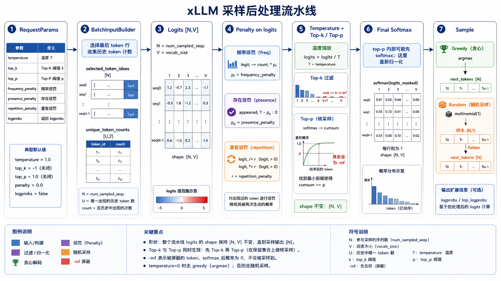
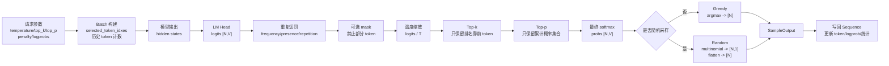

# xLLM 采样原理：模型如何从一排分数里选出下一个 token

2026-06-03

`xLLM` · `Sampling` · `Temperature` · `Top-k` · `Top-p` · `Penalty` · `Logprobs`

大模型生成文本时，并不是一次性把整段回答写出来。它更像是在做一轮又一轮的“文字接龙”：每一轮看着已经生成的内容，预测下一个 token 应该是什么。

用户问：

```text
对于 UDP 协议，如果想实现可靠传输，应在哪一层实现？
```

模型下一步可能会觉得：

```text
"应用"  很可能
"传输"  也有可能
"网络"  不太可能
"苹果"  基本不可能
```

采样，就是从这些“可能性”里选出一个 token 的过程。

这篇文章会从四个问题讲清楚 xLLM 里的采样：

1. 为什么要采样。
2. 什么是采样。
3. 采样具体怎么做。
4. xLLM 当前有哪些采样参数，它们分别改变了什么。



---

## 1. 为什么要采样

模型每生成一个 token，本质上都在回答一个选择题：

```text
在整个词表里，下一个 token 选谁？
```

词表可能有十几万个 token。模型会给每个 token 打一个原始分数，这个分数叫 `logit`。

假设下一步候选 token 的分数是：

```text
"应用": 12.0
"传输": 9.5
"网络": 6.2
"苹果": -4.0
```

最简单的做法是永远选分数最高的 token，也就是 `"应用"`。这叫 greedy decoding。

greedy 的优点是稳定、确定、容易复现。它适合评测、代码生成、固定答案题这类希望模型少发散的场景。但它也有明显缺点：模型会一直走最保守的路径，容易变得模板化，甚至在某些场景里重复同一句话。

另一种做法是把这些分数转成概率，然后按照概率抽一个 token。分数越高，被抽中的概率越大，但不一定每次都选第一名。这就是 sampling。

所以采样解决的问题是：

```text
模型已经给出了每个 token 的倾向，
系统应该用多保守、多随机的方式选出下一个 token？
```

这也是为什么采样参数很重要。它们不是模型权重的一部分，而是控制“怎么从模型分数里选 token”的后处理策略。

---

## 2. 什么是 logits、softmax 和概率

模型输出的是 logits，不是概率。

logits 可以是任意实数：

```text
[12.0, 9.5, 6.2, -4.0]
```

概率必须满足两个条件：

```text
每个值 >= 0
所有值加起来 = 1
```

因此需要用 `softmax` 把 logits 转成概率：

```text
logits -> softmax -> probs
```

直观理解：

```text
logit 越大，概率越大。
logit 差距越大，概率分布越尖。
logit 差距越小，概率分布越平。
```

例如：

```text
logits:
"应用": 12.0
"传输": 9.5
"网络": 6.2

softmax 后可能接近:
"应用": 0.91
"传输": 0.08
"网络": 0.01
```

有了概率之后，xLLM 最后会走两类选择方式：

```text
greedy:
  取概率最大的 token，也就是 argmax。

random sampling:
  按概率分布随机抽一个 token，也就是 multinomial。
```

---

## 3. xLLM 一步采样的完整链路

一次生成中，xLLM 的采样链路可以概括成：

```text
请求参数
  -> BatchInputBuilder 收集参数和历史 token 统计
  -> 模型 forward 得到 hidden states
  -> LM Head 得到 logits
  -> logits 后处理
  -> softmax 得到概率
  -> argmax 或 multinomial 得到 next token
  -> 写回 Sequence
```

其中最关键的张量是 logits。

普通 decode 场景下，logits 的形状通常是：

```text
[N, V]
```

含义是：

```text
N = 本轮要采样的 sequence 数量
V = vocab size，词表大小
```

例如：

```text
[4, 151936]
```

表示本轮有 4 条请求要各自选一个下一个 token，每条请求都对 151936 个词表 token 打了分。

---

## 4. 总流程图



---

## 5. xLLM 的代码入口在哪里

采样参数定义在：

```text
xllm/core/framework/request/request_params.h
```

单请求默认参数如下：

| 参数 | 默认值 | 含义 |
|---|---:|---|
| `temperature` | `0.0` | 默认 greedy，不随机 |
| `top_p` | `1.0` | 不做 top-p 过滤 |
| `top_k` | `-1` | 不做 top-k 过滤 |
| `frequency_penalty` | `0.0` | 不按出现次数惩罚 |
| `presence_penalty` | `0.0` | 不按是否出现惩罚 |
| `repetition_penalty` | `1.0` | 不做 repetition penalty |
| `logprobs` | `false` | 不返回 logprob |
| `top_logprobs` | `0` | 不返回 top logprobs |

请求进入 batch 后，`BatchInputBuilder` 会收集每条 sequence 的采样参数、要采样的位置、历史 token 计数：

```text
xllm/core/framework/batch/batch_input_builder.cpp
```

`SamplingParameters::init()` 会把这些参数整理成 batch tensor：

```text
xllm/core/framework/sampling/sampling_params.cpp
```

真正修改 logits 和选择 token 的地方在：

```text
xllm/core/framework/sampling/logits_utils.cpp
xllm/core/framework/sampling/sampler.cpp
```

---

## 6. selected_token_idxes：为什么不是每个位置都采样

模型 forward 可能会输出很多 token 的 hidden states，尤其在 prefill 或 chunked prefill 场景里，一次 forward 可能包含一段 prompt 的多个 token。

但生成下一个 token 时，通常只需要每条序列最后一个有效位置。

所以 xLLM 会用 `selected_token_idxes` 选出需要送进 LM Head 的 hidden row：

```text
hidden_states [total_tokens, hidden_dim]
selected_token_idxes [N]
  -> selected hidden states [N, hidden_dim]
  -> LM Head
  -> logits [N,V]
```

简单说：

```text
不是所有历史 token 都要采样。
每条正在生成的请求，只需要它当前要接龙的那个位置。
```

---

## 7. 为什么采样前要先改 logits

如果直接对原始 logits 做 softmax，然后抽 token，模型会完全按照原始分数来生成。

但实际服务里，我们经常希望控制输出：

```text
少重复一点。
随机性低一点。
只从最靠谱的一批 token 里选。
不要生成某些被禁止的 token。
需要返回 logprob 方便调试或评测。
```

这些控制大多发生在 softmax 之前，也就是先修改 logits。

xLLM 当前主要有这些后处理：

```text
frequency_penalty
presence_penalty
repetition_penalty
filter_mask
temperature
top_k
top_p
```

它们的共同特点是：

```text
不改变模型权重。
不重新跑模型。
只改变当前这一轮 token 选择时的 logits 分布。
```

---

## 8. frequency_penalty：出现越多，扣得越多

`frequency_penalty` 按 token 已经出现的次数扣分。

xLLM 里的核心逻辑可以理解为：

```text
score -= count * frequency_penalty
```

假设 token `"答案"` 已经出现了 3 次，`frequency_penalty = 0.5`，那么这个 token 的 logit 会被扣：

```text
3 * 0.5 = 1.5
```

它适合抑制这种情况：

```text
答案答案答案答案...
```

出现越多，惩罚越强。

---

## 9. presence_penalty：只要出现过，就扣一次

`presence_penalty` 不关心出现了几次，只关心有没有出现过。

xLLM 里的核心逻辑可以理解为：

```text
if count > 0:
  score -= presence_penalty
```

如果一个 token 出现过 1 次和出现过 10 次，presence penalty 扣分是一样的。

它更像是在鼓励模型“换点新词”，而不是严格按重复次数打压。

---

## 10. repetition_penalty：正负 logits 分开处理

`repetition_penalty` 也是为了减少重复，但它的处理方式和前两个不同。

xLLM 对已经出现过的 token，会根据 logit 正负分别处理：

```text
if score < 0:
  score *= repetition_penalty
else:
  score /= repetition_penalty
```

默认值是 `1.0`，表示不生效。

当 `repetition_penalty > 1.0` 时：

```text
原来很想生成的重复 token，分数会变低。
原来就不太想生成的重复 token，分数会更低。
```

这类 penalty 的重点是：它们都发生在 softmax 之前。因为 logits 还没有归一化，此时改分数最直接。

---

## 11. temperature：控制保守还是发散

temperature 会把 logits 除以一个温度值：

```text
logits = logits / temperature
```

直觉上：

```text
temperature 越低，分布越尖，模型越保守。
temperature 越高，分布越平，模型越发散。
```

举个例子：

```text
原始 logits:
"应用": 12.0
"传输": 9.5
"网络": 6.2
```

当 `temperature = 0.5`：

```text
logits / 0.5:
"应用": 24.0
"传输": 19.0
"网络": 12.4
```

分数差距变大，softmax 后第一名更占优势。

当 `temperature = 2.0`：

```text
logits / 2.0:
"应用": 6.0
"传输": 4.75
"网络": 3.1
```

分数差距变小，后面的 token 更有机会被抽中。

xLLM 当前有一个容易误解的点：

| 配置 | 行为 |
|---|---|
| `temperature = 0` | greedy，走 `argmax` |
| `temperature = 1` | 随机采样，但不需要做 `logits / 1` |
| `temperature = 0.5` | 随机采样，并执行 `logits / 0.5` |

也就是说，`temperature = 1` 和 `temperature = 0.5` 都是随机采样路径，最后都会走 `multinomial`。区别是 `0.5` 会先缩放 logits，让分布更尖；`1` 不改变 logits。

---

## 12. top-k：只从排名前 k 的 token 里选

`top_k` 的意思是：每条请求只保留 logit 排名前 k 的 token，其余 token 直接设为负无穷。

例如 `top_k = 3`：

```text
排序后:
rank 0: "应用"
rank 1: "传输"
rank 2: "网络"
rank 3: "链路"
rank 4: "苹果"

保留:
"应用" "传输" "网络"

过滤:
"链路" "苹果" ...
```

代码里经常会看到 `processed_top_k` 和 `arange` 比较，本质是在构造一个按排名过滤的 mask：

```text
rank = arange(vocab_size)
mask = rank >= processed_top_k
```

如果 `top_k = 3`：

```text
rank: 0 1 2 3 4 5 ...
mask: F F F T T T ...
```

被 mask 的位置会被填成 `-inf`，softmax 后概率就是 0。

注意，top-k 不会把 logits 的 shape 从 `[N,V]` 改成 `[N,k]`。它只是把不允许的 token 分数改成 `-inf`，shape 仍然是 `[N,V]`。

---

## 13. top-p：只保留累计概率够用的一小群 token

`top_p` 又叫 nucleus sampling。它不是固定保留前几个，而是保留一组累计概率达到阈值的 token。

假设排序后的概率是：

```text
"应用": 0.60
"传输": 0.25
"网络": 0.08
"链路": 0.04
"苹果": 0.03
```

如果 `top_p = 0.9`，从高到低累计：

```text
0.60                  -> 保留 "应用"
0.60 + 0.25 = 0.85    -> 保留 "传输"
0.85 + 0.08 = 0.93    -> 保留 "网络"
```

到 `"网络"` 时累计概率已经超过 0.9，所以后面的 token 会被过滤。

top-p 的好处是自适应：

```text
如果模型非常确定，保留的 token 很少。
如果模型不确定，保留的 token 会更多。
```

xLLM 里 top-p 的通用实现会先对排序后的 logits 做一次 softmax，用来计算累计概率和 mask。之后真正采样前，`Sampler::forward()` 还会对过滤后的 logits 再做一次最终 softmax。

所以启用 top-p 时，概念上会出现两次 softmax：

```text
第一次:
  为了计算 top-p 的累计概率，决定过滤谁。

第二次:
  对过滤后的 logits 重新归一化，得到最终采样概率。
```

---

## 14. filter_mask：显式禁止某些 token

除了 top-k、top-p 这种按概率过滤，xLLM 还支持通过 mask 禁止某些 token。

可以把它理解成：

```text
这些 token 当前不能生成。
把它们的 logit 设成 -inf。
```

这样 softmax 后，它们的概率就是 0。

这类能力常见于约束解码、结构化输出、停止词控制等场景。

---

## 15. 最终到底是 argmax 还是 multinomial

在 `SamplingParameters::init()` 中，xLLM 会为每条 sequence 判断是否需要随机采样：

```text
sample = do_sample
      || temperature != 0.0
      || top_p != 1.0
      || top_k > 0
```

然后在 `Sampler::forward()` 里：

```text
probs = softmax(sample_logits)
```

如果全 batch 都是 greedy：

```text
next_token = probs.argmax(dim=-1)
```

输出 shape：

```text
[N]
```

如果全 batch 都是 random sampling：

```text
next_token = probs.multinomial(num_samples=1)
next_token = next_token.flatten()
```

中间 shape：

```text
[N,1]
```

最终 shape：

```text
[N]
```

如果一个 batch 里既有 greedy 请求，也有 random 请求，xLLM 会两个结果都算出来，然后按 `do_sample` 逐行选择：

```text
samples = where(do_sample, random, greedy)
```

---

## 16. top-k/top-p 后 logits shape 会不会变

通常不会变。

采样前：

```text
logits [N,V]
```

top-k 后：

```text
logits [N,V]
```

top-p 后：

```text
logits [N,V]
```

变化的是内容，不是形状。

被过滤的 token：

```text
logit = -inf
prob = 0
```

最后选出的 next token：

```text
[N]
```

也就是说，top-k/top-p 不是“把词表裁小”，而是在完整词表上打一个不可选标记。

---

## 17. 一个完整例子：从 logits 到 answer:D

假设当前有两条请求一起 decode：

```text
请求 0: UDP 想实现可靠传输，应在____实现
请求 1: TCP 提供的是____连接服务
```

本轮 logits shape 是：

```text
[2, V]
```

为了方便说明，只看几个 token：

```text
请求 0:
"应用": 12.0
"传输": 9.5
"网络": 6.2
"A": 4.0
"D": 3.8

请求 1:
"可靠": 11.0
"不可靠": 7.0
"无连接": 5.0
"面向": 4.5
```

如果 `temperature=0`：

```text
请求 0 选 "应用"
请求 1 选 "可靠"
```

因为 greedy 只看最大值。

如果 `temperature=1, top_p=0.9`：

```text
先用 top-p 过滤掉累计概率之外的 token。
再对剩下 token 做 softmax。
最后 multinomial 抽样。
```

请求 0 大概率仍然选 `"应用"`，但 `"传输"` 也有机会被抽中。请求 1 也是类似。

这就是采样的本质：不是让模型“乱选”，而是在模型认为合理的范围里引入可控的不确定性。

---

## 18. logprobs 返回的是什么

如果请求打开 `logprobs`，xLLM 会在采样后对处理过的 `sample_logits` 做：

```text
log_softmax(sample_logits)
```

然后取被选中 token 的 logprob。

如果 `top_logprobs > 0`，还会返回 logprob 最大的若干 token。

这里要注意口径：

```text
logprobs 反映的是后处理之后的分布。
```

也就是说，如果启用了 temperature、top-k、top-p 或 penalty，返回的 logprob 就不是原始模型 logits 直接 softmax 后的结果，而是这些策略生效后的结果。

---

## 19. 常见配置怎么理解

固定评测、追求复现：

```text
temperature = 0
top_p = 1
top_k = -1
```

这基本就是 greedy。适合对比精度、定位问题、做性能基线。

轻微随机、但不想太发散：

```text
temperature = 0.5 ~ 0.8
top_p = 0.9 ~ 0.95
```

模型仍然偏向高概率 token，但有一定变化。

更开放的创作：

```text
temperature 接近 1
top_p 适当放宽
```

输出更丰富，但也更容易不稳定。

压重复：

```text
frequency_penalty > 0
presence_penalty > 0
repetition_penalty > 1
```

具体要看任务。评测精度时一般不要随手打开这些参数，否则会改变模型原本的生成分布。

---

## 20. 调试采样问题时看什么

如果遇到输出重复、随机性异常、top-p/top-k 不生效，可以按这个顺序排查：

1. 请求参数是否真的进入了 `RequestParams`。
2. `SamplingParameters::init()` 里对应 tensor 是否 defined。
3. `do_sample` 是否符合预期。
4. `sample_logits` shape 是否是 `[N,V]`。
5. penalty 是否错误地惩罚了不该惩罚的 token。
6. top-k/top-p 是否把过多 token 设成 `-inf`。
7. 最终走的是 `argmax` 还是 `multinomial`。
8. 返回的 logprobs 是否是后处理后的口径。

尤其是 `temperature=1` 这个配置，经常被误以为“什么都不做”。实际上它不会缩放 logits，但会让请求进入随机采样路径。

---

## 21. 代码地图

| 模块 | 作用 |
|---|---|
| `xllm/core/framework/request/request_params.h` | 定义请求侧采样参数和默认值 |
| `xllm/core/framework/request/request_params.cpp` | 解析并校验 OpenAI/gRPC 请求参数 |
| `xllm/core/framework/batch/batch_input_builder.cpp` | 收集 batch 内采样位置、参数、历史 token 统计 |
| `xllm/core/framework/sampling/sampling_params.cpp` | 把请求参数整理成 batch tensor，并计算 `do_sample` |
| `xllm/core/framework/sampling/logits_utils.cpp` | 实现 penalty、temperature、top-k、top-p 等 logits 后处理 |
| `xllm/core/framework/sampling/sampler.cpp` | softmax、argmax/multinomial、logprobs 输出 |
| `xllm/core/framework/request/sequence.cpp` | 写回采样结果，更新 sequence 状态 |
| `xllm/core/framework/request/sequence_logprob_state.cpp` | 维护 logprob 输出状态 |

---

## 22. 一句话总结

采样不是模型主体计算，而是模型输出 logits 之后的一层决策策略。

```text
模型负责给词表打分。
采样负责决定怎么从分数里选 token。
```

xLLM 当前的采样流程可以压缩成：

```text
logits [N,V]
  -> penalty/mask/temperature/top-k/top-p
  -> softmax
  -> argmax 或 multinomial
  -> next_tokens [N]
```

理解了这条链路，再看 `temperature`、`top_k`、`top_p`、penalty、logprobs，就不会觉得它们是零散参数，而是一组围绕“如何选择下一个 token”设计的控制旋钮。

---

## 23. 图像生成记录

本文配图使用 `gpt-image-2-style-library` 中的 `Infographic Engine` 思路生成，目标是把 xLLM 采样后处理从 `RequestParams` 到 `SampleOutput` 的链路画成一张工程可读的技术图。
