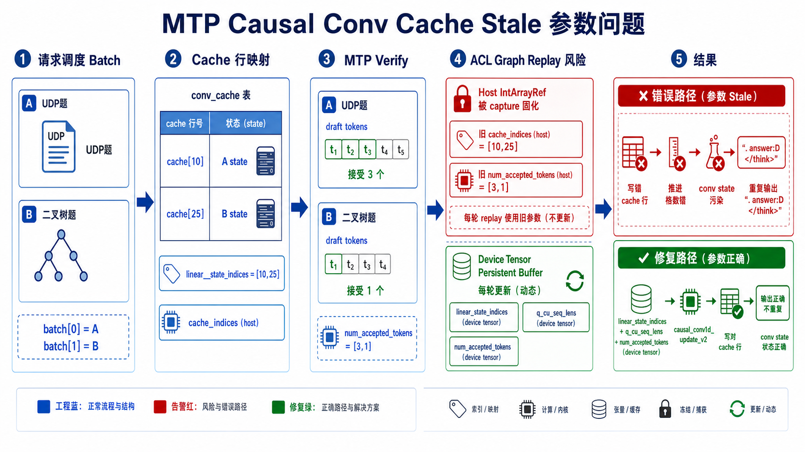

# Qwen3.5 MTP Causal Conv Cache Stale 参数问题分析

> 结论：PR #1536 合入后出现的 Qwen3.5 MTP 重复输出问题，本质不是普通 transpose 精度误差，而是 MTP spec verify 路径将 replay 会变化的状态控制参数 host 化，导致 ACL graph capture/replay 可能使用 stale `cache_indices` / `num_accepted_tokens`，进而污染 GatedDeltaNet causal conv cache。



## 1. 背景

Qwen3.5 的 GatedDeltaNet 中包含 causal conv1d 状态路径。该路径不是无状态算子，每个请求都有自己的 conv cache，用来保存最近若干 token 的卷积状态。

非 MTP decode 每轮只推进 1 个 token，状态更新相对简单。MTP spec verify 会一次验证多个 draft token，每条请求最终接受几个 draft token由 target verify 结果决定，因此每条请求的 conv cache 推进步数是动态的。

PR #1536 的初始目标是减少 MTP 路径的 transpose。非 MTP decode 已经复用 `npu_causal_conv1d`，权重和 layout 处理更优；MTP verify 原本走 `causal_conv1d_update_v2`，需要更多 transpose。优化尝试让 MTP verify 复用 `npu_causal_conv1d`，但该接口的关键动态参数是 host `IntArrayRef`，在 ACL graph replay 下引入了 stale 风险。

## 2. 关键参数语义

### 2.1 conv cache

对 causal conv 来说，当前位置只依赖当前 token 和最近 `kernel_size - 1` 个历史 token。因此普通 decode 的 conv cache 可以理解为一个滑动窗口。

例如 `kernel_size = 4`：

```text
旧 cache: [A7, A8, A9]
新 token: A10
新 cache: [A8, A9, A10]
```

MTP verify 一次处理多个连续 token。若 `seq_len = 4`，需要 expanded cache：

```text
expanded_state_len = kernel_size - 1 + seq_len - 1
                   = 3 + 3
                   = 6
```

这对应代码中的检查：

```cpp
const int64_t expanded_state_len = conv_cache.size(1);
CHECK_EQ(expanded_state_len, conv_kernel_size - 1 + seq_len - 1);
```

### 2.2 cache_indices / linear_state_indices

二者语义一致，表示 batch 中每条 sequence 对应 conv cache 的哪一行。

```text
batch[0] = 请求 A -> conv_cache[10]
batch[1] = 请求 B -> conv_cache[25]

cache_indices / linear_state_indices = [10, 25]
```

差异在接口形态：

| 名称 | 出现场景 | 类型 | 风险 |
|---|---|---|---|
| `cache_indices_opt` | `npu_causal_conv1d` | host `IntArrayRef` | ACL graph capture 后可能 stale |
| `linear_state_indices` | `causal_conv1d_update_v2` / persistent path | device tensor | replay 前可更新 |

### 2.3 num_accepted_tokens

`num_accepted_tokens` 是 MTP 独有语义，表示每条请求本轮接受了几个 draft token，也就是 conv cache 应该向前推进几格。

例如 MTP=3：

```text
请求 A draft: A10, A11, A12
target 全接受
num_accepted_tokens[A] = 3

请求 B draft: B6, B7, B8
target 只接受 B6
num_accepted_tokens[B] = 1

num_accepted_tokens = [3, 1]
```

正确状态更新：

```text
A: conv_cache[10] [A7, A8, A9] -> [A10, A11, A12]
B: conv_cache[25] [B3, B4, B5] -> [B4, B5, B6]
```

如果 `num_accepted_tokens` stale 成 `[1, 3]`：

```text
A: 错误变成 [A8, A9, A10]
B: 错误变成 [B6, B7, B8]
```

B 的 `B7/B8` 明明没有被文本接受，却进入了 conv state；A 的文本已经推进到 A12，但 conv state 只推进到 A10。这会造成文本位置、KV cache 和 conv cache 不一致。

## 3. 为什么非 MTP 没暴露

不能简单说非 MTP host 参数绝对安全。更准确的结论是：所有 replay 会变化的 host `IntArrayRef` 都有 stale 风险，只是非 MTP decode 当前更少触发。

非 MTP decode 的特点：

1. 每条请求通常每轮只 decode 1 个 token。
2. 同一 decode graph bucket 下，`query_start_loc` 常常固定为 `[0, 1, 2, ...]`。
3. 同一批请求连续 decode 时，`cache_indices` 可能多轮不变。
4. 非 MTP 没有 `num_accepted_tokens`，状态推进默认固定 1 格。

例如：

```text
第 1 轮: batch=[A,B], cache_indices=[10,25]
第 2 轮: batch=[A,B], cache_indices=[10,25]
第 3 轮: batch=[A,B], cache_indices=[10,25]
```

这种情况下，即使 `cache_indices` 是 host 参数并被 graph capture 固化，真实 replay 值也碰巧一致，不会暴露。

但如果非 MTP 同一张 graph replay 时 batch 请求身份或 cache slot 变化：

```text
capture: batch=[A,B], cache_indices=[10,25]
replay:  batch=[C,D], cache_indices=[40,58]
```

若算子仍使用 stale host `[10,25]`，理论上也会写错 conv cache。因此非 MTP 并不是逻辑上无风险，只是当前事故没有稳定命中这个条件。

## 4. 为什么 MTP 更容易出问题

MTP 即使 batch 和 cache slot 不变，也可能因为 `num_accepted_tokens` 变化而出错。

同一个 batch：

```text
batch=[A,B]
linear_state_indices=[10,25]
```

第 1 轮 verify：

```text
num_accepted_tokens=[3,1]
```

第 2 轮 verify：

```text
num_accepted_tokens=[1,3]
```

shape 完全一样，但语义结果不同。graph key 如果只按 padded token 数或 batch size 分桶，无法区分这两种 accepted-token pattern。若 `num_accepted_tokens` 被 host `IntArrayRef` 固化，后续 replay 就可能用旧推进步数。

因此 MTP 的失败条件更弱：

```text
非 MTP 风险:
  cache_indices stale 且 batch/cache slot 变化

MTP 风险:
  num_accepted_tokens stale 即可出错；
  若 cache_indices 也 stale，则同时写错行和推进错格。
```

## 5. 代码对应

### 5.1 `npu_causal_conv1d` host 参数接口

```cpp
torch::Tensor causal_conv1d(const torch::Tensor& x,
                            const torch::Tensor& weight,
                            const torch::Tensor& conv_state,
                            const std::optional<torch::Tensor>& bias_opt,
                            const torch::IntArrayRef query_start_loc_opt,
                            const torch::IntArrayRef cache_indices_opt,
                            const torch::IntArrayRef initial_state_mode_opt,
                            const torch::IntArrayRef num_accepted_tokens_opt,
                            int64_t activation_mode,
                            int64_t pad_slot_id,
                            int64_t run_mode);
```

其中 `query_start_loc_opt`、`cache_indices_opt`、`initial_state_mode_opt`、`num_accepted_tokens_opt` 都是 host `IntArrayRef`。

### 5.2 非 MTP 使用 host `cache_indices`

```cpp
std::vector<int64_t> linear_state_indices_vec(
    input_params.linear_state_ids.begin(),
    input_params.linear_state_ids.end());

mixed_qkv = xllm::kernel::causal_conv1d(
    mixed_qkv,
    conv_weight,
    conv_cache,
    std::optional<torch::Tensor>(),
    torch::IntArrayRef(*qsl_ptr),
    torch::IntArrayRef(linear_state_indices_vec),
    has_initial_state,
    num_accepted_tokens_opt,
    1,
    -1,
    1);
```

这里 `num_accepted_tokens_opt` 为空，非 MTP 每条请求固定推进 1 token。

### 5.3 当前 MTP 修复后的 tensor 路径

```cpp
xllm::kernel::CausalConv1dUpdateParams conv1d_params;
conv1d_params.x = mixed_qkv.reshape({-1, mixed_qkv.size(-1)});
conv1d_params.conv_state = conv_cache.transpose(1, 2);
conv1d_params.weight = conv_weight.transpose(0, 1).contiguous();
conv1d_params.conv_state_indices = linear_state_indices;
conv1d_params.query_start_loc = q_cu_seq_lens;
conv1d_params.num_accepted_tokens = num_accepted_tokens;
torch::Tensor conv_output = xllm::kernel::causal_conv1d_update(conv1d_params);
```

修复点：

1. `linear_state_indices` 作为 tensor 传入，避免 stale cache row。
2. `q_cu_seq_lens` 作为 tensor 传入，避免 host qsl stale。
3. `num_accepted_tokens` 作为 tensor 传入，避免 stale accepted-token 推进。
4. `conv_cache.transpose(1, 2)` 是为了适配 `causal_conv1d_update_v2` 的 layout contract。

### 5.4 ACL graph persistent tensor 更新

graph replay 前更新 cache row tensor：

```cpp
persistent_linear_state_indices_
    .slice(/*dim=*/0, /*start=*/0, /*end=*/actual_batch_size)
    .copy_(params.linear_state_indices.slice(/*dim=*/0,
                                             /*start=*/0,
                                             /*end=*/actual_batch_size),
           /*non_blocking=*/true);
```

graph replay 前更新 accepted-token tensor：

```cpp
persistent_num_accepted_tokens_
    .slice(/*dim=*/0, /*start=*/0, /*end=*/actual_batch_size)
    .copy_(params.num_accepted_tokens.slice(/*dim=*/0,
                                            /*start=*/0,
                                            /*end=*/actual_batch_size),
           /*non_blocking=*/true);
```

capture 参数指向 persistent buffer：

```cpp
params_for_capture->linear_state_indices =
    persistent_linear_state_indices(padded_batch_size);

params_for_capture->num_accepted_tokens =
    persistent_num_accepted_tokens(padded_batch_size);
```

## 6. 现象解释：为什么会重复输出

重复输出不是 cache 问题的唯一证据，但在本场景中是强信号。

原因链路：

```text
MTP verify 动态参数 stale
  -> conv cache 写错行或推进错格
  -> GatedDeltaNet recurrent state 污染
  -> 文本位置、KV cache、conv cache 不一致
  -> logits 分布反复回到相似局部状态
  -> 重复输出 “。”、“answer:D”、“</think>”
```

普通数值误差通常表现为个别 token 分歧或答案波动；这次是长段结构性重复，更符合 stateful cache 污染。

## 7. 已验证与拒绝的方向

尝试过将 `aclnnCausalConv1d` 的动态参数全部改成 tensor workspace 路径，即使用 `aclnnCausalConv1dTensorGetWorkspaceSize`。该方向理论上能同时保留 `causal_conv1d` 的少 transpose 优势和 graph replay 正确性。

但实测 Qwen3.5 MTP spec decode 下 graph on/off 都会段错误。当时已确认 shape/dtype 合法：

```text
x=[1,4,2560] BF16
weight=[4,2560] BF16
conv_state=[89,6,2560] BF16
query_start_loc=[2] int64
cache_indices=[1] int64
num_accepted_tokens=[1] int64
```

因此当前不能把 tensor 版 `aclnnCausalConv1d` 作为修复。最终选择回到 `causal_conv1d_update_v2` tensor 参数路径，优先保证正确性。

## 8. 验证结论

正确性 smoke：

```text
模型: Qwen35-27B + Qwen35-27B-mtp
并行: TP=4
MTP: num_speculative_tokens=3
graph: on
chunk prefill: on
prompt: UDP 可靠传输 CEval 单题
max_tokens: 4096
```

结果：最终稳定输出 `answer:D`，未复现重复 `</think>`、重复 `。`、重复 `answer:D` 或空回复。

注意：这次正确性修复回到 `causal_conv1d_update_v2`，会牺牲 PR #1536 原始 transpose 消除收益。PR #1536 的性能表不能继续作为修复后收益证明，需要后续重新用同口径 evalscope/profiling 测试。

## 9. 后续 review 门禁

对 `npu_causal_conv1d` 这类 host `IntArrayRef` 参数，需要按 replay 语义分类：

| 参数 | 是否允许 host 化 | 判断标准 |
|---|---|---|
| 只依赖固定 graph bucket 的 shape 参数 | 可接受但需说明 | 同 bucket replay 值不变 |
| 依赖请求身份/cache slot 的参数 | 高风险 | 建议 tensor 化或加入 graph key |
| 依赖 prefix/cache restore 的状态参数 | 高风险 | 需要覆盖多并发和请求插入/退出 |
| MTP accepted-token 参数 | 不应 host 化 | 同 shape 下每轮变化 |

具体规则：

1. MTP verify 中 `linear_state_indices`、`q_cu_seq_lens`、`num_accepted_tokens` 必须走 persistent tensor。
2. 不能只用 parallel=1 验证 MTP graph 正确性，必须覆盖多并发、请求结束/插入、batch 顺序变化。
3. 如果为了性能重新复用 `causal_conv1d`，必须先证明 tensor workspace 路径 graph on/off 都稳定，或者新增 graph-safe fused spec causal conv。
4. 性能结论和正确性结论要分开写。减少 transpose 是性能目标，不能覆盖动态参数 replay 正确性。

## 10. 图像生成记录

使用 skill：`gpt-image-2-style-library`

选择模板：`Infographic Engine / 信息图引擎`

选择原因：该问题适合用 5 个模块表达数据流、状态流、错误路径和修复路径；信息图模板能限制文字长度、强化箭头和颜色分组。

生成图路径：

```text
docs/assets/mtp-causal-conv-cache-stale.png
```

核心 prompt 要求：

```text
中文技术原理图，16:9 横版，5 个模块：
请求调度 Batch -> Cache 行映射 -> MTP Verify -> ACL Graph Replay 风险 -> 结果。
红色错误路径展示 host IntArrayRef stale 导致写错 cache 行/推进格数错；
绿色修复路径展示 persistent device tensor + causal_conv1d_update_v2。
```

